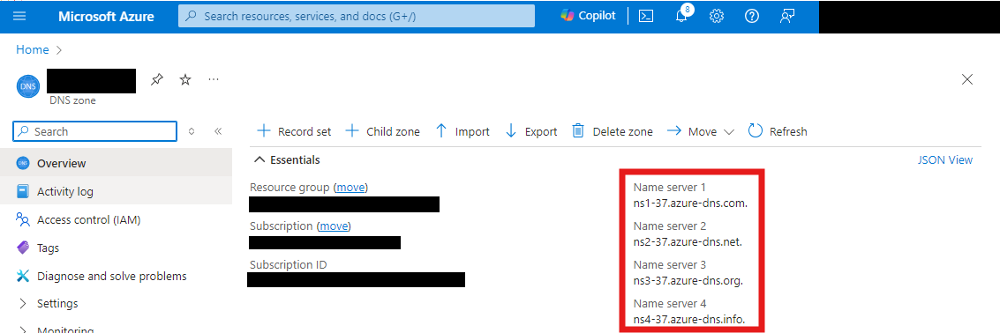

# Taitaja 2024 - Skill 205 - IT Specialist

This repository contains necessary files to deploy the [test project's](205_Taitaja2024_Pilvipalvelut_Finaali.pdf) hoster and competitor preparation infrastructure to Azure. Use a single subscription for all resources.

## Pre-requirements
- Azure subscription with owner permissions
- Permissions to create user accounts to Entra ID tenant (if using competitor user account creator script)
- Open AI Service whitelisting from Microsoft (https://aka.ms/oai/access)
- Public DNS name that can be used on hoster side and you have access to set name servers on this zone in domain's registrar service
- Az.* PowerShell Modules installed to your machine

## Installation steps
1. Run hoster side deployment. Remember to note output variables for website hosting *temp_site.zip* and root dns zone resource id
2. Create csv file by creating user accounts with a script or manually gathering UPN's and objectId's. If using script to create user accounts, password of account are stored also in csv-file.
3. Run competitor infrastructure creation script

## Hoster

Hoster side contains

- Public DNS Zone
- Storage account to provide necessary files for web page

### Deploy hoster

To deploy hoster side Azure resources, click the button below and fill necessary parameter values.

[](https://portal.azure.com/#create/Microsoft.Template/uri/https%3A%2F%2Fraw.githubusercontent.com%2Fmmaraa%2Ftaitaja2024%2Fmain%2Fhoster%2Fazuredeploy.json)

After you have deployed resources, find your DNS name servers under DNS zone resource and modify your domain registrar settings to point to newly created DNS zone.



### Modifications to test project

Instead of using https://kupla.eu/test_site.zip for students, replace the *websiteUrl*-output value to the test project e.g. https://sataitaja24tesasjsfx2lo7.z1.web.core.windows.net/test_site.zip.

## Competitor

Competitor side contains:

- Script, which creates necessary user accounts for competitors. You can also create this file manually (check Deploy competitor below).
- Resource groups for given number of competitors including role assignments
- DNS zone for each competitor and ns-records to root dns-zone
- PowerShell-script that should be migrated towards the cloud in test project (source server not included)

### Deploy competitor

To deploy competitor side Azure resources, create CSV-file manually or by running **Create-CompetitionUserAccounts.ps1**. CSV Headers that you need are:

```csv
UserPrincipalName,ObjectId
```

If you are using the **Create-CompetitionUserAccounts.ps1**-script, you must give two parameters. 

|Parameter|Type|Description|
|---------|----|-----------|
|countOfCompetitors|integer|Count of competitors to create|
|tenantDomainName|string|Public domain name that you have added to your Entra ID tenant. You can use also domain ending .onmicrosoft.com|

#### Example

```powershell
.\Create-CompetitorUserAccounts.ps1 -countOfCompetitors 10 -tenantDomainName "kupla.eu"
```

After you have user account CSV available, you can continue to run competitor side deployment by running **Create-CompetitionInfrastructure.ps1** script. Check parameters for modifications.

|Parameter|Type|Mandatory|Default|Description|
|---------|----|-----------|---|---|
|csvPath|string|true|-|Path to user csv-file|
|deploymentLocation|string|false|swedencentral|Deployment region for resources|
|competitionName|string|true|-|Used to name resource groups|
|rootDnsZoneId|string|true|-|Hoster root DNS zone resourceId|
|targetSubscriptionId|string|true|-|ID of subscription where you want to deploy competitor resource groups|
|villeUserObjectId|string|true|-|Object ID for user Ville who needs privileges to Windows Admin Center|

#### Example

```powershell
.\Create-CompetitionInfrastructure.ps1 -csvPath ".\competitorUserAccounts.csv" -competitionName "taitaja2024" -rootDnsZoneId "/subscriptions/c95e8492-4f56-48ce-a609-8b312638e773/resourceGroups/rg-taitaja2024-hoster-prod-001/providers/Microsoft.Network/dnszones/kupla.eu" -targetSubscriptionId "c95e8492-4f56-48ce-a609-8b312638e773" -villeUserObjectId "f3b8b6ed-69b1-4056-9ee6-215339c800af"
```

## Marking

For marking test projects, there are two scripts. One for generating error in the automation account script running to test alerting and second one for checking test projects for marks. 80% of marks are tested automatically and rest need some manual step.

### Test-AutomationTask.ps1

```powershell
.\Test-AutomationTask.ps1 -resourceGroupName 'rg-competitor-k1-Taitaja2024-prod-001' -subscriptionId '00000000-0000-0000-0000-000000000000'
```

### Check-Competitors.ps1

Create CSV file with schema: name,number,resourcegroupname,sftpaccount,sftppassword

```powershell
.\Check-Competitors.ps1 -csvPath '.\competitors.csv' -subscriptionId '00000000-0000-0000-0000-000000000000'
```

## Contribution

Repository was created during the preparation of Taitaja 2024 Cloudservice test project and it **is not planned to update** after the competition. After the cloud service test project is ended and the protest time is over, the repository visibility is changed to public. Feel free to use this repository for teaching and training. 